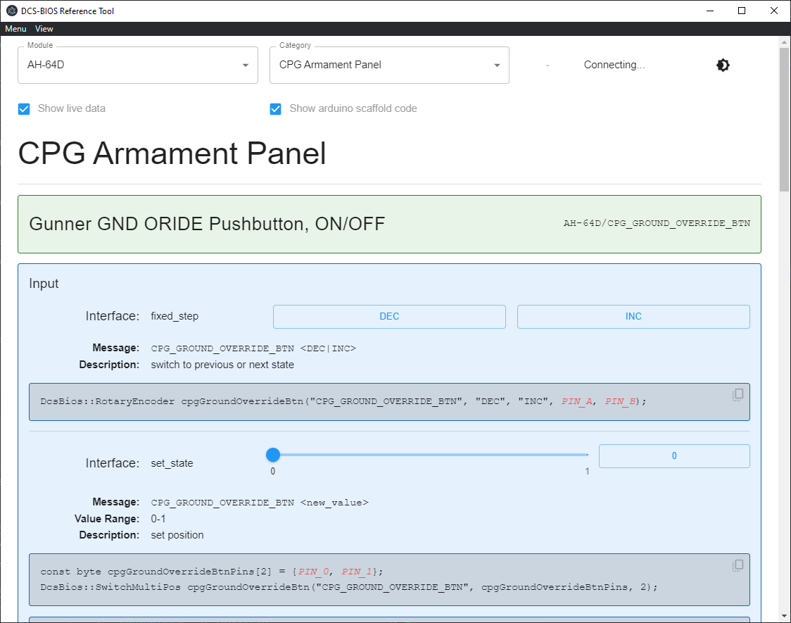

## Bort

Bort (Bios Reference Tool) is a modern (probably) UI for [dcs-bios](https://github.com/DCS-Skunkworks/dcs-bios) written as a standalone electron app.

It is designed as a modern replacement for the old bios reference tool that runs as a Chrome app, which are [no longer supported](https://support.google.com/chrome/thread/174381169?visit_id=638069310111462121-3654496055&p=chrome_app_deprecation&rd=1).

## Why?

The old bios reference tool used a framework that has now reached end-of-life, and I wanted to try my hand at migrating it to a newer, more modern system.

That said, I'm not a frontend engineer. This thing could use a lot of improvement, but my _hope_ is by putting it in a more modern framework that somebody might actually be willing to help out now.

## Installation

Download and run the setup for the [latest release](https://github.com/DCS-Skunkworks/Bort/releases/latest) for your operating system (for 99.9% of you, this will be `bort-x.y.z.Setup.exe`). 

## Usage

Upon first running the tool and if you installed DCS when OpenBeta was a thing, you'll need to tell it where dcs-bios is, so it can load all the configuration files. Go to `Menu -> Select dcs-bios location` (or just press `Ctrl+O`) and select the folder where the dcs-bios json files are located (e.g. `%USERPROFILE%/Saved Games/DCS.openbeta/Scripts/DCS-BIOS/doc/json`). Once this has been set, it doesn't need to be set again.

## Contributing

Please somebody help me. I have no idea what I'm doing. Pull requests are always welcome 😃.
